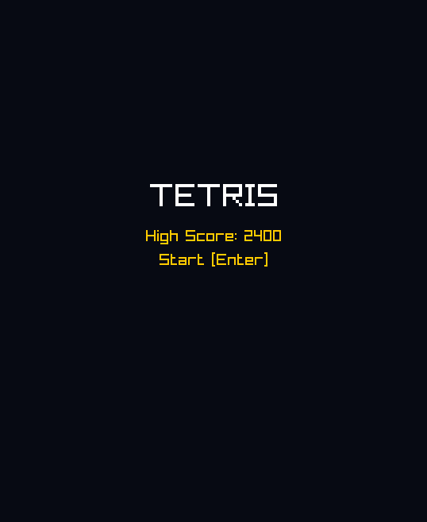
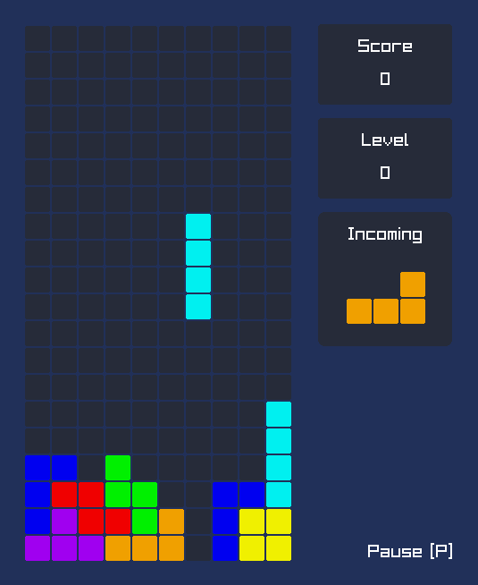
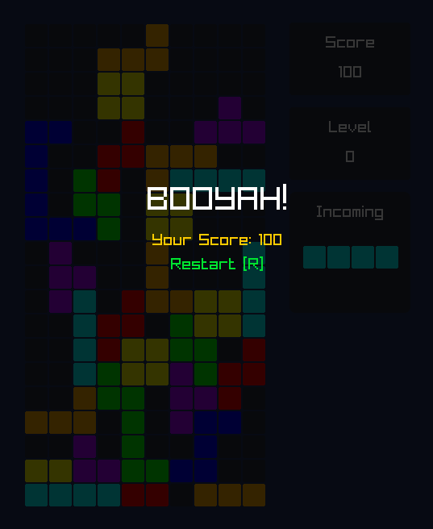

## About
### Project
This project is a simple [Tetris](https://en.wikipedia.org/wiki/Tetris) game developed as part of the Advanced Programming Course (Course Code: 2425II_INT2215_7) at VNU-UET. The primary goal of this project is to gain hands-on experience in software development, utilizing programming languages and their libraries, while also practicing code modularization and refactoring.

### Author
Nguyen Ba Hoang Minh (Student ID: 24021568)

### Previews
| <p align="center">Start Screen</p> | <p align="center">Main Screen</p> | <p align="center">End Screen</p> |
|---------|---------|---------|
| |  |  | 

### References
- Drop speed: [Tetris (NES)](https://tetris.wiki/Tetris_(NES))
- Tetromino rotation logic: [Super Rotation System](https://harddrop.com/wiki/SRS)
- Block sound effects: [Minecraft Wiki](https://minecraft.fandom.com/wiki/Category:Block_sounds)
- Gameover sound effect: [Pixabay](https://pixabay.com/sound-effects/game-over-arcade-6435/)
- Background music: [Tetris Theme Song](https://www.youtube.com/watch?v=NmCCQxVBfyM&pp=ygUMdGV0cmlzIHRoZW1l)

## Development
### Prerequisites
1. **Build system generator**: [CMake](https://cmake.org/download/)

2. **Build system**: [Ninja](https://github.com/ninja-build/ninja/releases)

3. **Windows Installer**: [NSIS](https://nsis.sourceforge.io/Download)

3. **VSCode Extensions**: [C/C++ Extension Pack](https://marketplace.visualstudio.com/items?itemName=ms-vscode.cpptools-extension-pack)

### Installation & Build
1. **Fork and Clone**: Fork this repository to your remote account and clone it onto your local machine. 
2. **Open in VS Code**: Launch [Visual Studio Code](https://code.visualstudio.com/) and open the cloned repository.
3. **Configure CMake** : Run the following command to create a CMake configuration: 

    ```
    make config
    ```

4. **Build**: Run Ninja to compile the project: 

    ```
    make build
    ```

5. **Test**: Once the build is complete, run the following: 

    Run all tests:

    ```
    make test
    ```

    Run specific test: (e.g., `BoardTest`, `TetrominoTest`):

    ```
    make test_one TEST_NAME=<TestName>
    ```

6. **Run**: Once the build is complete, run the following to see the project in action:

    ```
    make run
    ```

7. **Pack**: Run the following to generate an installer for the game:

    ```
    make pack
    ```

## Release

- Checkout the latest version at [Github Releases](https://github.com/zadnap/tetris/releases)