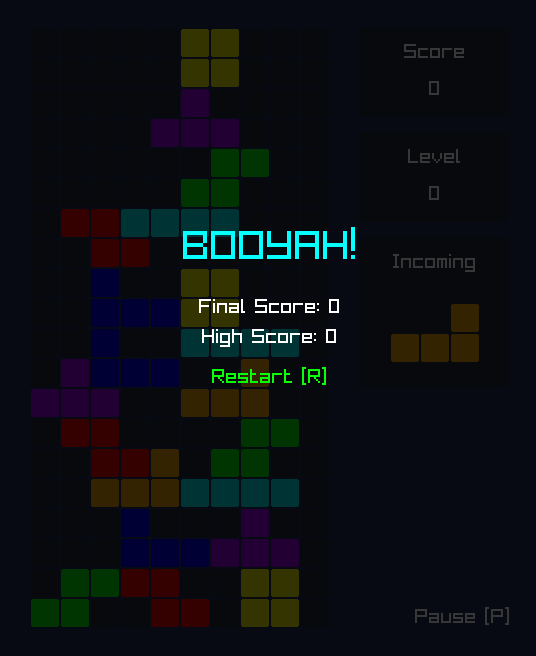

## About
This project is a simple Tetris game developed as part of the Advanced Programming Course (Course Code: 2425II_INT2215_7) at VNU-UET. The primary goal of this project is to gain hands-on experience in software development, utilizing programming languages and their libraries, while also practicing code modularization and refactoring.

## Author
Nguyen Ba Hoang Minh (Student ID: 24021568)

## What is Tetris?
Tetris is a classic puzzle game where players stack falling blocks (called tetrominoes) to create complete horizontal lines. For more background information, visit [Tetris - Wikipedia](https://en.wikipedia.org/wiki/Tetris).

## Rules
1. **Objective**: Clear lines by arranging falling tetrominoes. The game ends if blocks reach the top.
2. **Tetrominoes**: Seven different shapes (I, O, T, L, J, S, Z) made of four squares.
3. **Movement**: Players can move left, right, rotate, soft drop (faster descent), or hard drop (instant place).
4. **Clearing Lines**: Full rows disappear, earning points; clearing multiple lines gives more points.
5. **Scoring & Levels**: Higher scores for multi-line clears; the game speeds up as levels increase.
6. **Game Over**: The game ends when the stack reaches the top with no moves left.

## Previews
| <p align="center">Main Screen</p> | <p align="center">End Screen</p> |
|---------|---------|
|  |  |

## Requirements
Before setting up this project, ensure you have the following installed on your local machine:
- [CMake](https://cmake.org/download/) – Build system generator.
- [Ninja](https://github.com/ninja-build/ninja/releases) – Build system.
- [C/C++ Extension Pack](https://marketplace.visualstudio.com/items?itemName=ms-vscode.cpptools-extension-pack) - Required for Visual Studio Code.

## Development Setup
Follow these steps to set up and run the project:

1. **Fork and Clone**: Fork this repository to your remote account and clone it onto your local machine. 
2. **Open in VS Code**: Launch [Visual Studio Code](https://code.visualstudio.com/) and open the cloned repository.
3. **Configure CMake** : Run the following command to create a CMake configuration: 

    ```
    cmake --preset tetris-debug
    ```

4. **Build**: Run Ninja to compile the project: 

    ```
    ninja -C out/build/tetris-debug
    ```

5. **Test**: Once the build is complete, run the following: 

    - To run all tests:

    ```
    ctest --test-dir ./out/build/tetris-debug/tests
    ```

    - To run specific test: (e.g., `BoardTest`, `TetrominoTest`):

    ```
    ctest --test-dir ./out/build/tetris-debug/tests -R <TestName>
    ```

6. **Run**: Once the build is complete, run the following to see the project in action:

    ```
    ./out/build/tetris-debug/tetris_main.exe
    ```
